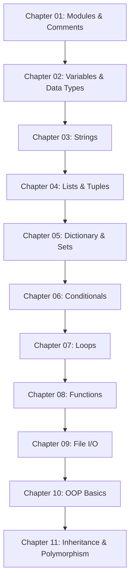

← [Index](./index.md) | 🏠 [Home](../README.md) | [Summary](./summary.md) →
[Index](./index.md) | [Summary](./summary.md) | [Resources](./resources.md)

# 🛣️ Python Learning Roadmap

This roadmap is designed to guide you step-by-step from zero knowledge to intermediate mastery.

## 📊 Phase 1: Core Fundamentals

| Chapter | Topic | Difficulty | Estimated Time | Expected Outcomes |
| :--- | :--- | :--- | :--- | :--- |
| **01** | Modules & Comments | ⭐☆☆☆☆ | 2 Hours | Understand REPL, pip, and basic syntax. |
| **02** | Variables & Data Types | ⭐☆☆☆☆ | 3 Hours | Memory concepts, types, and operators. |
| **03** | Strings | ⭐⭐☆☆☆ | 4 Hours | String slicing, methods, and immutability. |
| **04** | Lists & Tuples | ⭐⭐☆☆☆ | 5 Hours | Mutable vs Immutable data structures. |
| **05** | Dictionary & Sets | ⭐⭐⭐☆☆ | 5 Hours | Key-value pairs, hashing, and set logic. |

## 🧠 Phase 2: Control Flow *(Upcoming)*
*To be added once the foundation is solid.*
- Conditionals (`if/elif/else`)
- Loops (`for/while`)

---
### Next Recommended Step
Check your progress on the **[Summary Page](./summary.md)** or dive straight into **[Chapter 01](../Chapter_01/README.md)**.
